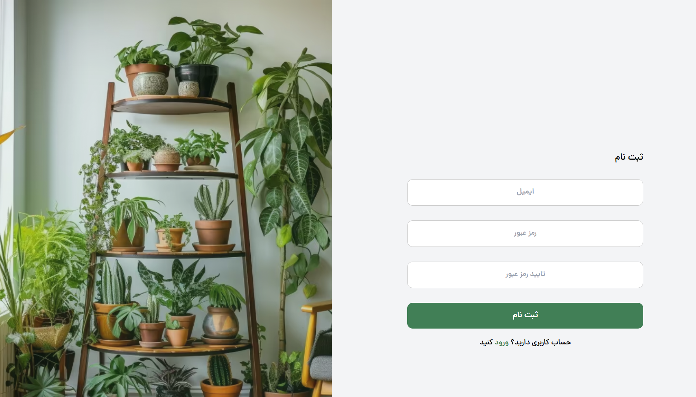
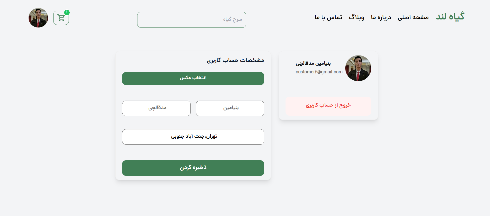
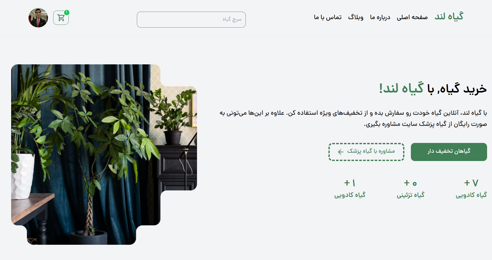
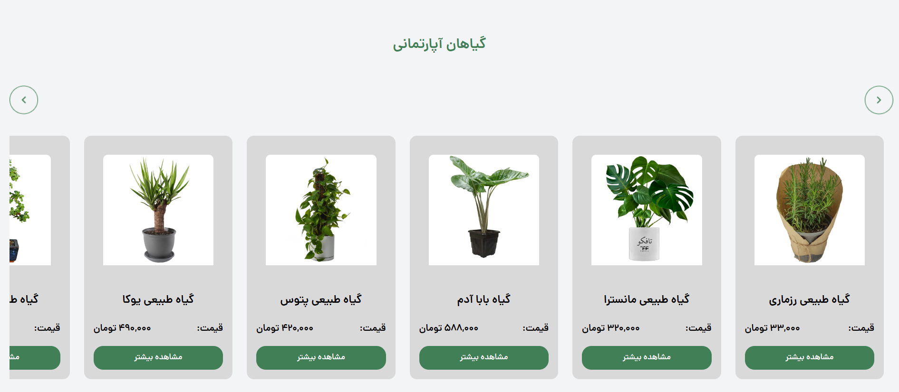
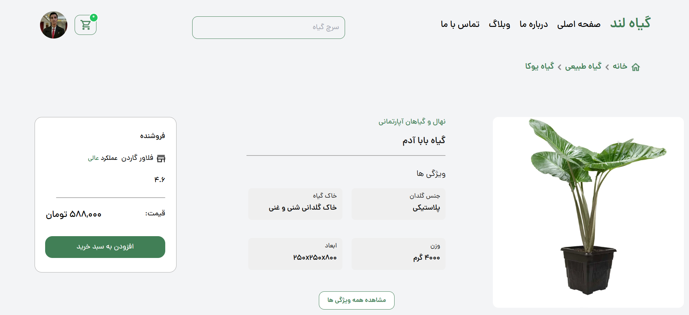
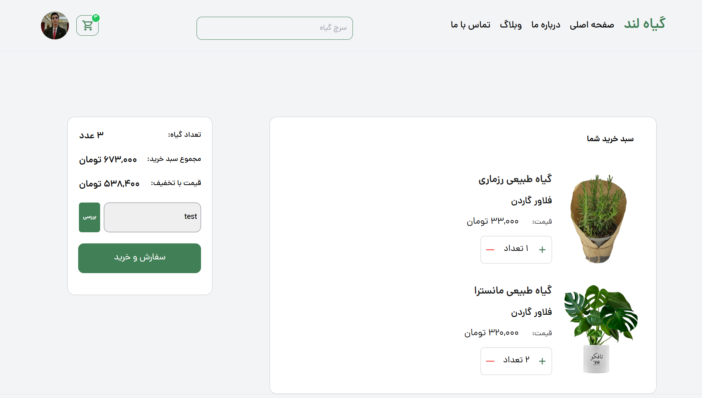

<div align="center">
<h1 align="center">Django Tailwind Setup</h1>
<h3 align="center">This is an document about how to connect django to tailwind</h3>
</div>
<p align="center">
<a href="https://www.python.org" target="_blank">  </a>
<a href="https://www.djangoproject.com/" target="_blank" rel="noreferrer">  </a>
<a href="https://www.sqlite.org/" target="_blank" rel="noreferrer">  </a>
<a href="https://developer.mozilla.org/en-US/docs/Web/JavaScript" target="_blank" rel="noreferrer">  </a>
<a href="https://jquery.com/" target="_blank" rel="noreferrer">  </a>
<a href="https://www.w3.org/html/" target="_blank" rel="noreferrer">  </a>
<a href="https://www.w3schools.com/css/" target="_blank" rel="noreferrer">  </a>
<a href="https://tailwindcss.com/" target="_blank" rel="noreferrer">  </a>
</p>

# Demo


<hr>

<hr>

<hr>

<hr>

<hr>

<hr>

<hr>

# Guideline
- [Collabration](#collabration)
- [Tailwind Setup](#tailwind-setup)
    - [First Step](#first-step)
    - [Requirements](#requirements)
    - [Django-Tailwind Package](#django-tailwind-package)
    - [Usage](#usage)
    - [Django_Browser_Reload](#django_browser_reload)
- [Start Project](#start-project)
- [Thanks For Visiting](#thanks-for-visiting)


# Collabration
This project is collabration between me as BackEnd and <a href='https://github.com/Amir-Sharafi-86'>Sharafi</a> as FrontEnd developer

# Tailwind Setup

## First Step
In the begining you need to setup your django project

## Requirements

### Node
Ensure that <a href='https://nodejs.org/en'>node js</a> is installed on your computer by running this command :
```bash
node -v
```

### Npm
The reason of node is for <a href='https://www.npmjs.com/'>npm</a> pakage so ensure that it's installed by node :
```bash
npm -v
```

## Django-Tailwind Package

### Installing
let's start whith installing  <a href='https://django-tailwind.readthedocs.io/en/latest/installation.html'>django-tailwind
</a>, It's pakage for connect django and tailwind :

```bash
python -m pip install django-tailwind
```

### Setting
Add `'tailwind'` to `INSTALLED_APPS` in `settings.py` :
```python
INSTALLED_APPS = [
  # other Django apps
  'tailwind',
]
```
### Tailwind Initialising
Create a Tailwind CSS compatible Django app, I like to call it `theme` :
```bash
python manage.py tailwind init
```

### New App
Add your newly created `'theme'` app to `INSTALLED_APPS` in `settings.py` :
```python
INSTALLED_APPS = [
  # other Django apps
  'tailwind',
  'theme'
]
```

### Register Tailwind App
Register the generated `'theme'` app by adding the following line to `settings.py` file :
```python
TAILWIND_APP_NAME = 'theme'
```

### INTERNAL_IPS
Make sure that the `INTERNAL_IPS` list is present in the `settings.py` file and contains the `127.0.0.1` ip address :
```python
INTERNAL_IPS = [
    "127.0.0.1",
]
```

### Last Prepration
Install Tailwind CSS dependencies, by running the following command :
```bash
python manage.py tailwind install
```

## Usage

### Option
The Django Tailwind comes with a simple `base.html` template located at `your_tailwind_app_name/templates/base.html` . You can always extend or delete it if you already have a layout .

If you are not using the `base.html` template that comes with Django Tailwind, add `` to the base.html template :
```django

...
<head>
   ...
   
   ...
</head>
```
The `` tag includes Tailwind’s stylesheet .

## Django_Browser_Reload
Let’s also add and configure `django_browser_reload` , which takes care of automatic page and css refreshes in the development mode . Add it to `INSTALLED_APPS` in `settings.py` :
```python
INSTALLED_APPS = [
  # other Django apps
  'tailwind',
  'theme',
  'django_browser_reload'
]
```
Staying in `settings.py` , add the middleware:
```python
MIDDLEWARE = [
  # ...
  "django_browser_reload.middleware.BrowserReloadMiddleware",
  # ...
]
```

The middleware should be listed after any that encode the response, such as Django’s `GZipMiddleware` . The middleware automatically inserts the required script tag on HTML responses before `</body>` when `DEBUG` is `True` .

Include `django_browser_reload` URL in your root `url.py` :
```python
from django.urls import include, path
urlpatterns = [
    ...,
    path("__reload__/", include("django_browser_reload.urls")),
]
```

# Start Project
Run your django :
```bash
python manage.py runserver
```

Finally, you should be able to use Tailwind CSS classes in HTML. Start the development server by running the following command in your terminal :
```bash
python manage.py tailwind start
```

# Thanks For Visiting
I hope that you enjoy it, Let me know if you have any suggestion